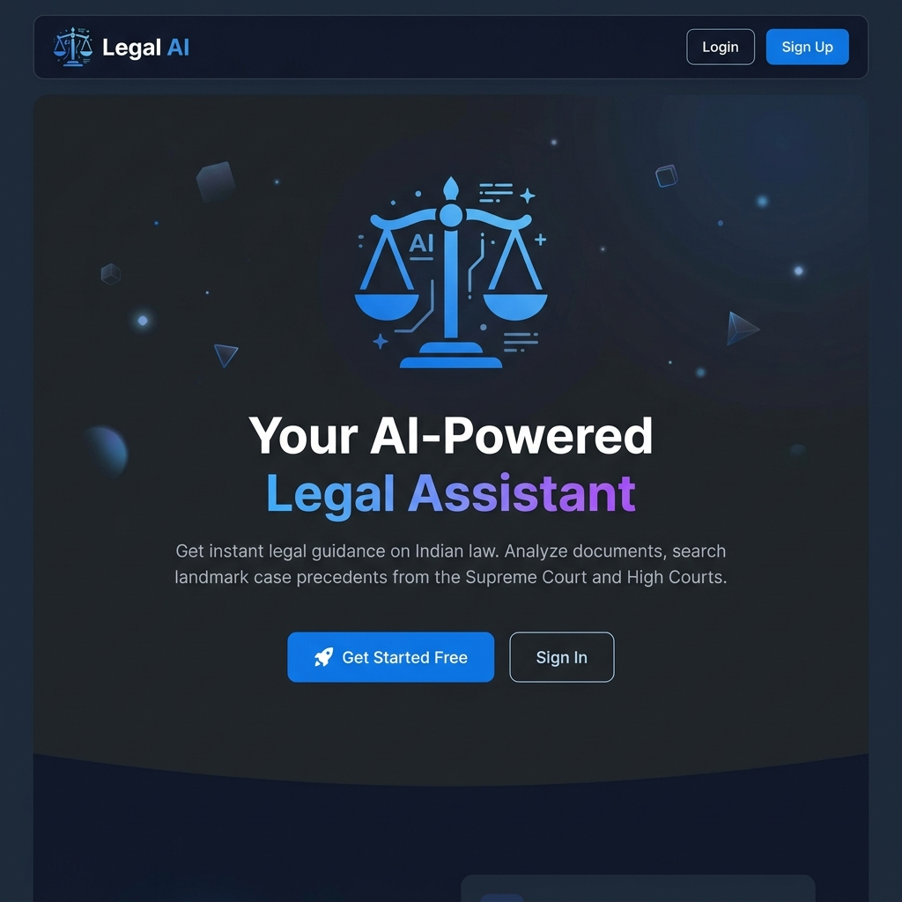
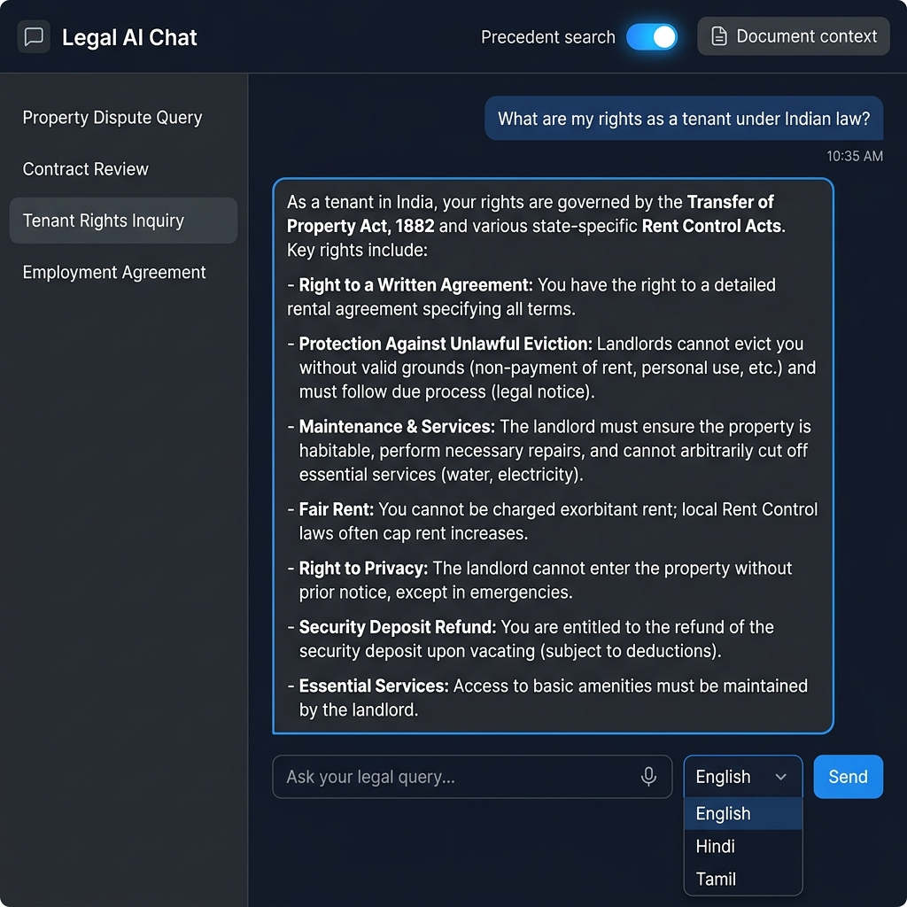
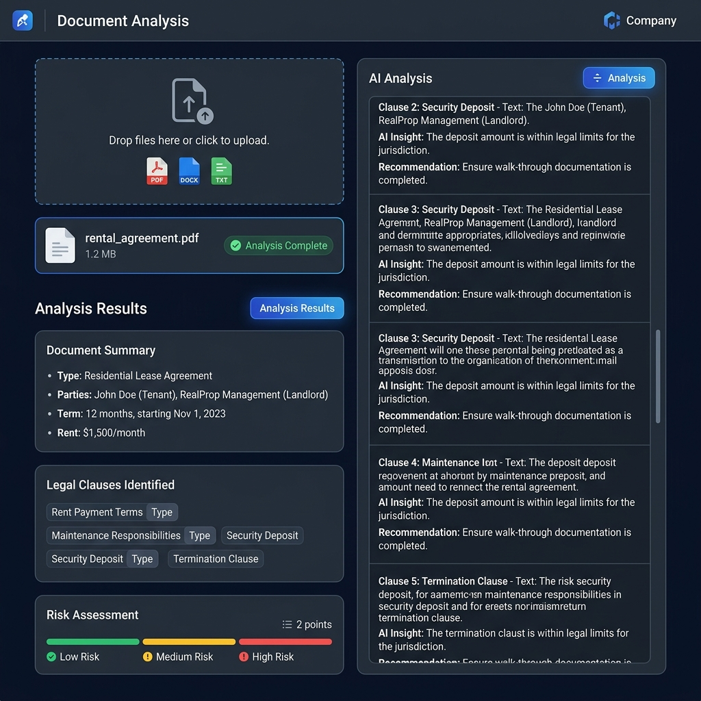
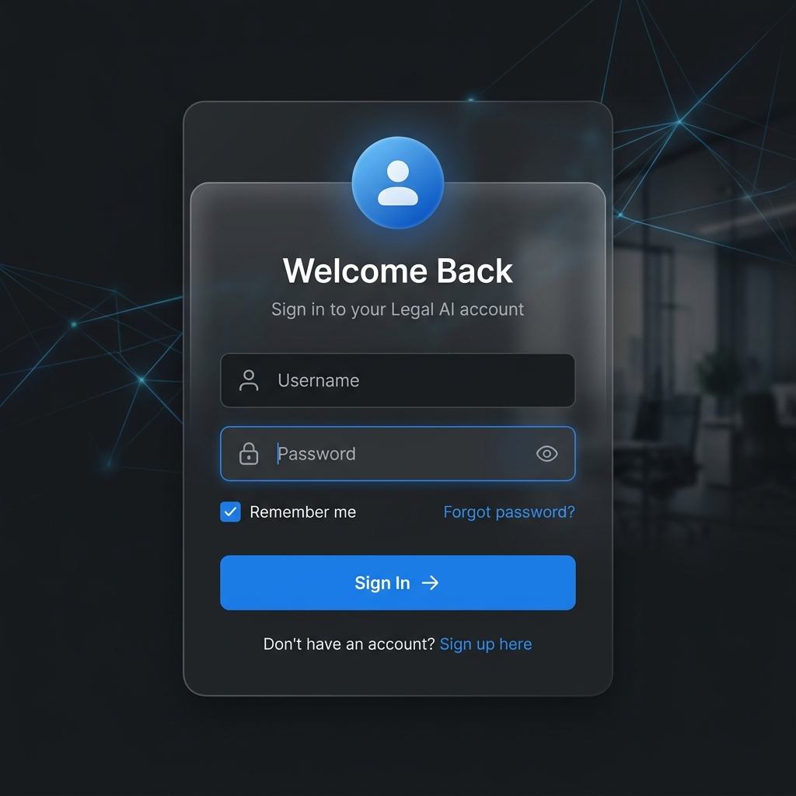
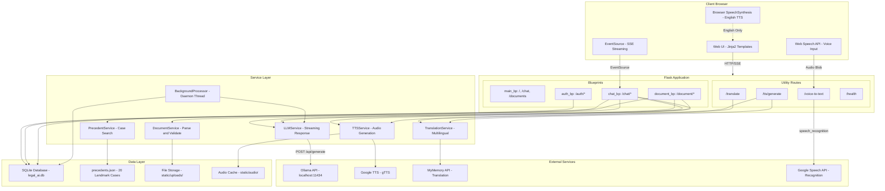
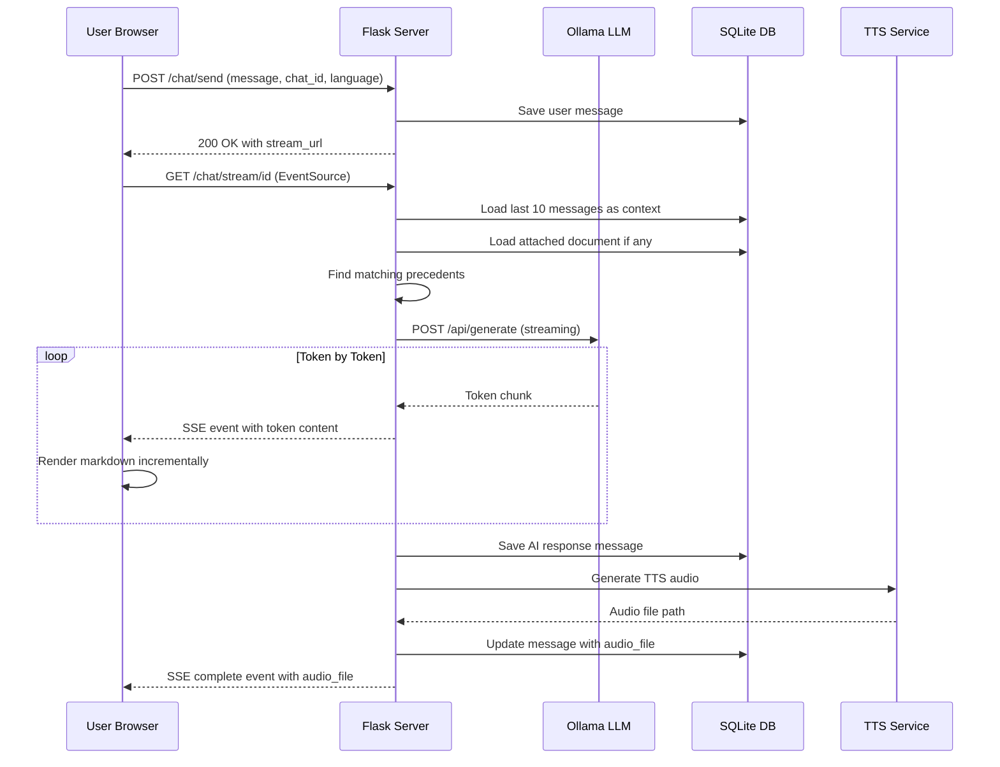
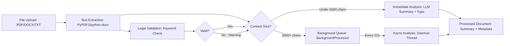
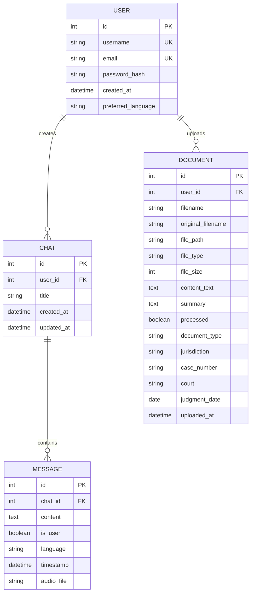

<div align="center">

# ⚖️ Real-Time Legal Advisory Services via AI

### AI-Powered Indian Law Advisory Platform

[](https://python.org)
[](https://flask.palletsprojects.com)
[](https://ollama.com)
[](https://sqlite.org)
[](LICENSE)

A full-stack, real-time legal advisory web application that leverages Large Language Models (LLMs) to provide instant legal guidance on **Indian law**. Features include AI-powered chat with streaming responses, document analysis, multilingual support (English, Hindi, Tamil), text-to-speech, voice input, and a curated database of landmark Supreme Court precedents.

[Getting Started](#-getting-started) •
[Features](#-features) •
[Architecture](#-system-architecture) •
[API Reference](#-api-reference) •
[Screenshots](#-screenshots)

</div>

---

## 📸 Screenshots

<div align="center">

### Landing Page


*Modern, responsive landing page with hero section and feature highlights*

### AI Chat Interface


*Real-time streaming AI chat with sidebar history, voice input, and precedent search*

### Document Analysis


*Upload and analyze legal documents with AI-powered summarization and clause detection*

### Authentication


*Clean, secure authentication with dark/light theme support*

</div>

---

## ✨ Features

| Feature | Description |
|---------|-------------|
| 🤖 **AI Legal Chat** | Real-time streaming responses via Server-Sent Events (SSE) with context-aware conversation history |
| 📄 **Document Analysis** | Upload and analyze PDF, DOCX, and TXT legal documents with AI-powered summarization |
| 🔍 **Precedent Search** | Search through 20+ landmark Indian Supreme Court cases with keyword-based similarity scoring |
| 🌐 **Multilingual Support** | Chat in English, Hindi (हिन्दी), and Tamil (தமிழ்) with automatic language detection |
| 🔊 **Text-to-Speech** | Dual-mode TTS — browser-native for English, server-side gTTS for Hindi/Tamil |
| 🎤 **Voice Input** | Browser-based speech recognition (Web Speech API) with language-aware transcription |
| 🌙 **Dark/Light Theme** | System-aware theme toggle with persistent preference via localStorage |
| 🔐 **User Authentication** | Secure login/signup with Flask-Login, password hashing, and session management |
| ⚙️ **Background Processing** | Daemon thread auto-processes uploaded documents for summary and metadata extraction |
| 📊 **Health Monitoring** | `/health` endpoint for service status checks (database + LLM connectivity) |

---

## 🏗️ System Architecture

### High-Level Architecture



### Request Flow — AI Chat (Streaming)



### Document Processing Pipeline



### Database Entity Relationship



---

## 🛠️ Tech Stack

### Backend

| Technology | Purpose | Version |
|-----------|---------|---------|
| [Python](https://python.org) | Runtime | 3.10+ |
| [Flask](https://flask.palletsprojects.com) | Web framework | 2.3.3 |
| [Flask-SQLAlchemy](https://flask-sqlalchemy.palletsprojects.com) | ORM & database | 3.0.5 |
| [Flask-Login](https://flask-login.readthedocs.io) | Authentication | 0.6.3 |
| [Flask-CORS](https://flask-cors.readthedocs.io) | Cross-origin support | 4.0.0 |
| [Werkzeug](https://werkzeug.palletsprojects.com) | WSGI utilities & password hashing | 2.3.7 |
| [Gunicorn](https://gunicorn.org) | Production WSGI server | 21.2.0 |

### AI & NLP

| Technology | Purpose |
|-----------|---------|
| [Ollama](https://ollama.com) | Local LLM inference (streaming) |
| [gTTS](https://gtts.readthedocs.io) | Google Text-to-Speech |
| [SpeechRecognition](https://pypi.org/project/SpeechRecognition/) | Voice-to-text (Google API) |
| [MyMemory API](https://mymemory.translated.net) | Translation (EN ↔ HI ↔ TA) |
| [langdetect](https://pypi.org/project/langdetect/) | Language detection |

### Document Processing

| Technology | Purpose |
|-----------|---------|
| [PyPDF2](https://pypdf2.readthedocs.io) | PDF text extraction |
| [python-docx](https://python-docx.readthedocs.io) | DOCX text extraction |

### Frontend

| Technology | Purpose |
|-----------|---------|
| HTML5 / CSS3 / JavaScript | Core web technologies |
| [Jinja2](https://jinja.palletsprojects.com) | Server-side templating |
| [marked.js](https://marked.js.org) | Markdown rendering in chat |
| [Font Awesome 6.5](https://fontawesome.com) | Icons |
| [Google Fonts (Inter)](https://fonts.google.com/specimen/Inter) | Typography |
| Web Speech API | Browser-native voice input |
| SpeechSynthesis API | Browser-native TTS (English) |
| EventSource (SSE) | Real-time streaming |

### Data Storage

| Technology | Purpose |
|-----------|---------|
| SQLite | Relational database (users, chats, documents) |
| JSON | Precedent case database |
| File System | Document uploads & TTS audio cache |

---

## 📁 Project Structure

```
Real-Time Legal Advisory Services via AI/
│
├── app.py                          # Application factory & entry point
├── config.py                       # Configuration (DB, Ollama, TTS, uploads)
├── requirements.txt                # Python dependencies
├── legal_ai_prompts.txt            # Sample prompts for testing
│
├── models/                         # SQLAlchemy database models
│   ├── __init__.py                 # Model registry & db instance
│   ├── user.py                     # User model (auth, preferences)
│   ├── chat.py                     # Chat & Message models
│   └── document.py                 # Document model (metadata, analysis)
│
├── routes/                         # Flask blueprints & API endpoints
│   ├── __init__.py
│   ├── auth.py                     # Authentication (login/signup/logout)
│   ├── chat.py                     # Chat endpoints & SSE streaming
│   └── document.py                 # Document upload & analysis
│
├── services/                       # Business logic layer
│   ├── __init__.py
│   ├── llm_service.py              # Ollama LLM integration (streaming)
│   ├── document_service.py         # Document parsing & validation
│   ├── tts_service.py              # Text-to-speech (gTTS)
│   ├── precedent_service.py        # Legal precedent search engine
│   ├── translation_service.py      # Multilingual translation (MyMemory)
│   └── background_processor.py     # Async document processing thread
│
├── templates/                      # Jinja2 HTML templates
│   ├── base.html                   # Base layout (navbar, theme, toasts)
│   ├── index.html                  # Landing page
│   ├── login.html                  # Login form
│   ├── signup.html                 # Registration form
│   ├── chat.html                   # AI chat interface (1500+ lines)
│   ├── documents.html              # Document management page
│   ├── 404.html                    # Not found error page
│   └── 500.html                    # Server error page
│
├── static/                         # Static assets
│   ├── uploads/                    # User-uploaded documents
│   ├── audio/                      # Generated TTS audio files (MP3)
│   └── favicon.ico                 # Site favicon
│
├── data/
│   └── precedents.json             # 20 landmark Indian Supreme Court cases
│
├── instance/
│   └── legal_ai.db                 # SQLite database (auto-generated)
│
└── docs/
    └── screenshots/                # Application screenshots
        ├── landing_page.png
        ├── chat_interface.png
        ├── document_analysis.png
        └── login_page.png
```

---

## 🚀 Getting Started

### Prerequisites

| Requirement | Version | Purpose |
|-------------|---------|---------|
| **Python** | 3.10+ | Runtime environment |
| **pip** | Latest | Package manager |
| **Ollama** | Latest | Local LLM server |
| **Git** | Latest | Version control |

### Step 1: Clone the Repository

```bash
git clone https://github.com/Karthik-333/Real-Time-Legal-Advisory-Services-via-AI.git
cd Real-Time-Legal-Advisory-Services-via-AI
```

### Step 2: Create Virtual Environment (Recommended)

```bash
# Create virtual environment
python -m venv venv

# Activate (Windows)
venv\Scripts\activate

# Activate (macOS/Linux)
source venv/bin/activate
```

### Step 3: Install Dependencies

```bash
pip install -r requirements.txt

# Also install SpeechRecognition (not in requirements.txt)
pip install SpeechRecognition
```

### Step 4: Install & Configure Ollama

1. **Install Ollama** from [ollama.com](https://ollama.com)

2. **Pull a model** (choose one):
   ```bash
   # Recommended: Lightweight model for testing
   ollama pull llama3.2

   # Or use the configured model
   ollama pull gpt-oss:120b-cloud
   ```

3. **Update `config.py`** if using a different model:
   ```python
   OLLAMA_MODEL = 'llama3.2'  # Change to your pulled model
   ```

4. **Verify Ollama is running:**
   ```bash
   # Ollama should be serving at http://localhost:11434
   curl http://localhost:11434/api/tags
   ```

### Step 5: Run the Application

```bash
python app.py
```

The server starts on **http://localhost:5000** with:
- ✅ SQLite database auto-created (`instance/legal_ai.db`)
- ✅ Demo user auto-created: `demo` / `demo123`
- ✅ Default precedents auto-generated (if missing)
- ✅ Background processor started

### Step 6: Access the Application

Open your browser and navigate to:

| URL | Description |
|-----|-------------|
| `http://localhost:5000` | Landing page |
| `http://localhost:5000/auth/login` | Login page |
| `http://localhost:5000/chat` | AI Chat (requires login) |
| `http://localhost:5000/documents` | Document Analysis (requires login) |
| `http://localhost:5000/health` | Health check endpoint |

> **Demo Credentials:** Username: `demo` • Password: `demo123`

---

## ⚙️ Configuration

All configuration is managed in [`config.py`](config.py):

| Variable | Default | Description |
|----------|---------|-------------|
| `SECRET_KEY` | `'your-secret-key...'` | Flask session secret (set via `SECRET_KEY` env var) |
| `SQLALCHEMY_DATABASE_URI` | `sqlite:///legal_ai.db` | Database connection string |
| `UPLOAD_FOLDER` | `static/uploads` | Document upload directory |
| `MAX_CONTENT_LENGTH` | `16 MB` | Maximum upload file size |
| `ALLOWED_EXTENSIONS` | `{txt, pdf, docx}` | Permitted file types |
| `OLLAMA_API_URL` | `http://localhost:11434` | Ollama server URL |
| `OLLAMA_MODEL` | `gpt-oss:120b-cloud` | LLM model name |
| `TTS_LANGUAGES` | `{english, tamil, hindi}` | Supported TTS languages |
| `PRECEDENTS_FILE` | `data/precedents.json` | Precedent database path |
| `PERMANENT_SESSION_LIFETIME` | `24 hours` | Session duration |

### Environment Variables

```bash
# Optional: Override defaults via environment variables
export SECRET_KEY="your-production-secret-key"
export DATABASE_URL="sqlite:///path/to/production.db"
export FLASK_ENV="development"    # Enables debug mode
export PORT=5000                  # Server port
```

---

## 📡 API Reference

### Authentication — `/auth`

| Method | Endpoint | Auth | Request Body | Description |
|--------|----------|------|-------------|-------------|
| `GET` | `/auth/login` | ❌ | — | Render login page |
| `POST` | `/auth/login` | ❌ | `{username, password}` | Authenticate user |
| `GET` | `/auth/signup` | ❌ | — | Render signup page |
| `POST` | `/auth/signup` | ❌ | `{username, email, password, confirm_password, preferred_language}` | Register new user |
| `GET` | `/auth/logout` | ✅ | — | Logout & redirect |
| `GET` | `/auth/profile` | ✅ | — | Get user profile JSON |
| `POST` | `/auth/update_language` | ✅ | `{language}` | Update preferred language |

### Chat — `/chat`

| Method | Endpoint | Auth | Request Body | Description |
|--------|----------|------|-------------|-------------|
| `POST` | `/chat/send` | ✅ | `{message, chat_id?, language, enable_precedents, ttsLanguage, document_id?}` | Send message, get stream URL |
| `GET` | `/chat/stream/<chat_id>` | ✅ | Query: `language, tts_language, enable_precedents, document_id` | **SSE** — Stream AI response tokens |
| `GET` | `/chat/history` | ✅ | Query: `page, per_page` | Paginated chat history |
| `GET` | `/chat/<chat_id>/messages` | ✅ | — | All messages in a chat |
| `DELETE` | `/chat/<chat_id>` | ✅ | — | Delete chat & audio files |
| `POST` | `/chat/precedents/search` | ✅ | `{query, legal_area?, limit?}` | Search precedent database |

### Documents — `/document`

| Method | Endpoint | Auth | Request Body | Description |
|--------|----------|------|-------------|-------------|
| `POST` | `/document/upload` | ✅ | Multipart: `file` | Upload & analyze document |
| `GET` | `/document/list` | ✅ | Query: `page, per_page` | Paginated document list |
| `GET` | `/document/<doc_id>` | ✅ | — | Get document details |
| `POST` | `/document/<doc_id>/query` | ✅ | `{question, language}` | **SSE** — Ask about a document |
| `DELETE` | `/document/<doc_id>` | ✅ | — | Delete document & file |
| `POST` | `/document/<doc_id>/reprocess` | ✅ | — | Re-analyze document |
| `GET` | `/document/status/<doc_id>` | ✅ | — | Check processing status |

### Utility Routes

| Method | Endpoint | Auth | Request Body | Description |
|--------|----------|------|-------------|-------------|
| `POST` | `/translate` | ✅ | `{text, source_lang, target_lang}` | Translate text |
| `POST` | `/tts/generate` | ✅ | `{text, ttsLanguage or language}` | Generate TTS audio (MP3) |
| `POST` | `/voice-to-text` | ✅ | Multipart: `audio` | Convert audio to text |
| `GET` | `/health` | ❌ | — | Service health status |
| `GET` | `/static/precedents.json` | ❌ | — | Full precedent database |

### SSE Streaming Event Format

```javascript
// Token event (incremental response)
data: {"type": "token", "content": "The Indian Contract Act..."}

// Completion event
data: {"type": "complete", "audio_file": "static/audio/tts_xxx.mp3", "full_response": "..."}

// Error event
data: {"type": "error", "content": "Failed to generate response"}
```

---

## 📚 Legal Precedent Database

The application includes **20 landmark Indian Supreme Court cases** in [`data/precedents.json`](data/precedents.json):

| # | Case | Year | Legal Area |
|---|------|------|------------|
| 1 | Kesavananda Bharati v. State of Kerala | 1973 | Constitutional Law |
| 2 | Maneka Gandhi v. Union of India | 1978 | Constitutional Law |
| 3 | Vishaka v. State of Rajasthan | 1997 | Women's Rights |
| 4 | D.K. Basu v. State of West Bengal | 1997 | Criminal Law |
| 5 | Navtej Singh Johar v. Union of India | 2018 | Civil Rights |
| 6 | K.S. Puttaswamy v. Union of India | 2017 | Constitutional Law |
| 7 | Shayara Bano v. Union of India | 2017 | Family Law |
| 8 | Shreya Singhal v. Union of India | 2015 | IT Law |
| ... | *+ 12 more landmark cases* | | |

**Legal Areas Covered:** Constitutional Law, Criminal Law, Civil Rights, Women's Rights, Family Law, Environmental Law, IT Law, Medical Law

---

## 🧪 Sample Prompts

Try these prompts to test the application (from [`legal_ai_prompts.txt`](legal_ai_prompts.txt)):

```
1. Explain the difference between civil law and criminal law in the Indian context.
2. What are the fundamental rights guaranteed under Article 21 of the Indian Constitution?
3. Summarize the landmark case Kesavananda Bharati v. State of Kerala.
4. How does the Indian Contract Act define the essential elements of a valid contract?
5. What are the legal remedies available for wrongful termination in India?
6. Explain the provisions of the Digital Personal Data Protection Act, 2023.
7. What are the differences between copyright and trademark under Indian law?
8. How can a land boundary dispute be resolved through legal means in India?
```

---

## 🔧 Troubleshooting

| Issue | Solution |
|-------|----------|
| **Ollama not available** | Ensure Ollama is running: `ollama serve`. Check `http://localhost:11434/api/tags` |
| **Model not found** | Pull the model: `ollama pull llama3.2` and update `OLLAMA_MODEL` in `config.py` |
| **Import errors** | Ensure all deps installed: `pip install -r requirements.txt && pip install SpeechRecognition` |
| **Database errors** | Delete `instance/legal_ai.db` and restart — tables auto-recreate |
| **TTS not working** | Check internet connection (gTTS requires Google API access) |
| **Voice input not working** | Use Chrome/Edge (Web Speech API not supported in all browsers) |
| **File upload fails** | Check file size (max 16MB) and type (PDF, DOCX, TXT only) |
| **Port already in use** | Change port: `PORT=8000 python app.py` |

---

## 🚢 Production Deployment

### Using Gunicorn (Linux/macOS)

```bash
gunicorn -w 4 -b 0.0.0.0:5000 "app:create_app()"
```

### Using Waitress (Windows)

```bash
pip install waitress
waitress-serve --host=0.0.0.0 --port=5000 --call app:create_app
```

### Environment Variables for Production

```bash
export SECRET_KEY="$(python -c 'import secrets; print(secrets.token_hex(32))')"
export FLASK_ENV="production"
export DATABASE_URL="sqlite:///production.db"
```

---

## 🤝 Contributing

Contributions are welcome! Here's how:

1. **Fork** the repository
2. **Create** a feature branch: `git checkout -b feature/amazing-feature`
3. **Commit** your changes: `git commit -m 'Add amazing feature'`
4. **Push** to the branch: `git push origin feature/amazing-feature`
5. **Open** a Pull Request

---

## 📄 License

This project is licensed under the MIT License — see the [LICENSE](LICENSE) file for details.

---

## ⚠️ Disclaimer

> This application provides **AI-generated legal information** for educational purposes only. It is **not a substitute for professional legal advice**. Always consult a qualified legal professional for specific legal matters. The AI responses may contain inaccuracies and should be independently verified.

---

<div align="center">

**Built with ❤️ for the Indian Legal Community**

[⬆ Back to Top](#️-real-time-legal-advisory-services-via-ai)

</div>
